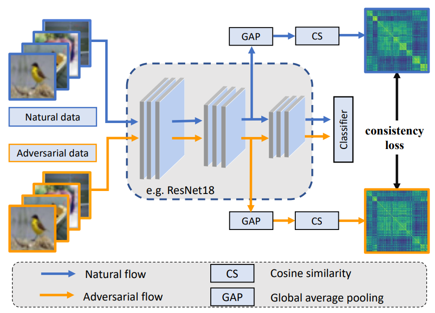
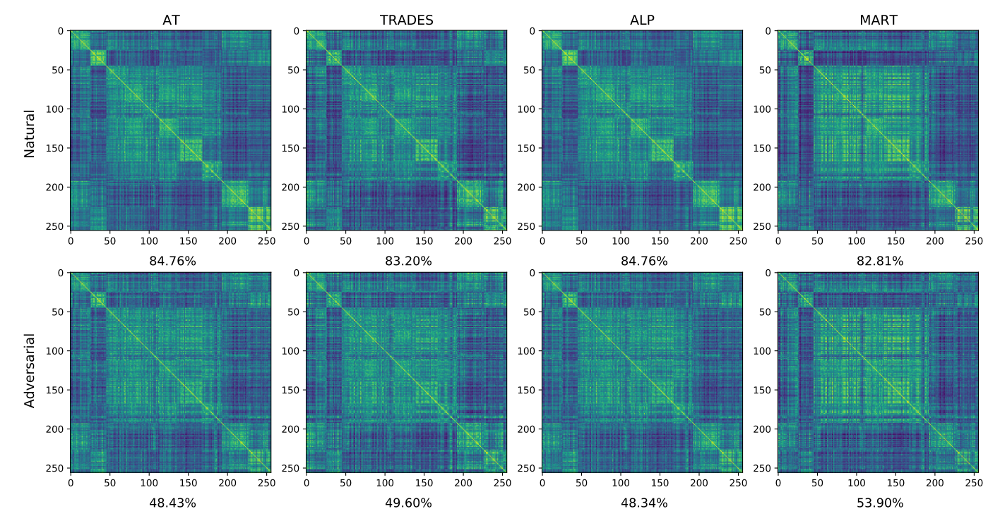
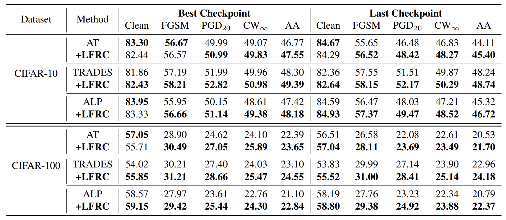

# Latent Feature Relation Consistency for Adversarial Robustness

This is the official implementation of [Latent Feature Relation Consistency for Adversarial Robustness](https://arxiv.org/abs/2303.16697).
<p align="center">
  
</p>


## News :tada:
- May 2023 - Release the code and models.
- March 2023 - Release the pre-print on [arXiv](https://arxiv.org/abs/2303.16697).


## Installation
This repo is built upon `python==3.8.5` and `pytorch==1.6.0`.

## What we found
The similarity matrix of natural examples is more **compact** than adversarial examples, i.e., the similarity matrix of natural examples has brighter blocks on the diagonal than the adversarial similarity matrix, which indicates that the latent representations of natural examples from the same class are more concentrated than those of adversarial examples.

<p align="center">
  
</p>


## Results
The white-box robustness of **LFRC** with ResNet-18 on CIFAR-10 and CIFAR-100 datasets is shown below. Please refer to our paper for more details. The models' weight and train-logs can be found in [here](https://drive.google.com/drive/folders/1WPPWnWOP5f_yaGusXf7kMlXxqmGgt6WK?usp=sharing).

<p align="center">
  
</p>


## License

This project is under the Apache 2.0 license as found in [LICENSE](LICENSE) file.

## Citing LFRC

Please consider citing LFRC and giving a star if LFRC helps your research:
```
@article{liu2023latent,
  title={Latent Feature Relation Consistency for Adversarial Robustness},
  author={Liu, Xingbin and Kuang, Huafeng and Liu, Hong and Lin, Xianming and Wu, Yongjian and Ji, Rongrong},
  journal={arXiv preprint arXiv:2303.16697},
  year={2023}
}
``` 
